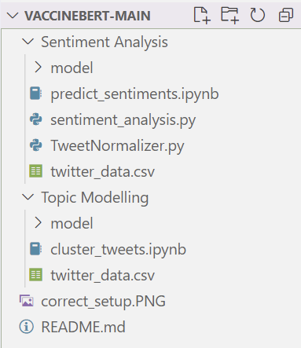

# vaccineBERT

This Github Repo has instructions and code to use the vaccineBERT model to both predict sentiments of Tweets and group a given set of Tweets into clusters. The vaccineBERT model is a [BERT model](https://towardsdatascience.com/bert-explained-state-of-the-art-language-model-for-nlp-f8b21a9b6270) that is trained on a corpus of vaccine related Tweets. The extensive training on these Tweets should improve the performance of the model on related data.  

There are two ways to use the vaccineBERT model, either through a Docker container or by downloading this repo and executing the Python code directly. Executing the code directly requires you to download additional packages and a folder containing our model, so we recommend using Docker.

## Using vaccineBERT with Docker (recommended)

## using vaccineBERT with Python

To directly run the code in this repo, we have included two Jupyter notebooks, one for topic modelling (`cluster_tweets.ipynb`) and one for sentiment analysis (`predict_sentiments.ipnyb`). Each of these files has specific instructions that you can follow once opening the notebooks, but there is some necessary pre-processing detailed below.

1. Download and extract this repository.
2. As the actual BERT model itself is too large to be stored here, download the models used from [this dropbox link](https://www.dropbox.com/s/1vcsqk393pp6596/model.zip?dl=0).
3. Extract the `model` folder into the `Topic Modelling` folder within the repo and copy the folder into the `Sentiment Analysis` directory. Make sure that both folders are named "model".
4. Copy your data into both the `Topic Modelling` and `Sentiment Analysis` folders.
5. If your setup looks like the picture below, then you can open either of the Jupyter notebooks and follow the instructions from there!

