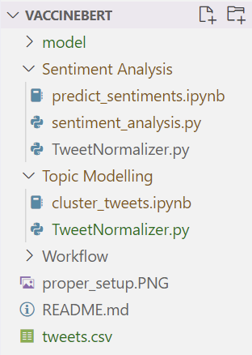

# vaccineBERT

This Github Repo has instructions and code to use the vaccineBERT model to both predict sentiments of Tweets and group a given set of Tweets into clusters. The vaccineBERT model is a [BERT model](https://towardsdatascience.com/bert-explained-state-of-the-art-language-model-for-nlp-f8b21a9b6270) that is trained on a corpus of vaccine related Tweets. The extensive training on these Tweets should improve the performance of the model on related data.  

There are two ways to use the vaccineBERT model, either through a Docker container or by downloading this repo and executing the Python code directly. Executing the code directly requires you to download additional packages and a folder containing our model, so we recommend using Docker.

For more detailed information about the underlying code and the workflow, [click here](https://github.com/julianbernado/vaccineBERT/tree/main/workflow).

## Using vaccineBERT with Docker (recommended)

We recommend running our models using Docker as it provides a single computing environment with all of the necessary packages pre-installed, with less room for error. To do this, make sure you have [Docker installed](https://www.docker.com/get-started) and then take the following steps.

1. Create a directory somewhere on your computer that contains a CSV file with your Tweets.
2. Rename that CSV file to `tweets.csv` (case-sensitive) and change the title of the column containing the Tweets' text to `tweet_text`. You can do this by simply opening the text file and changing name at the top.
3. Open the Terminal (Mac) or Powershell (Windows) and download our [docker image](https://hub.docker.com/r/jbernado/vaccinebert) by typing `docker pull jbernado/vaccinebert`.
4. Navigate to the directory you created in part 1 within Terminal or Powershell using the `cd` command.
5. Enter the command `docker run -it --name bert_model -v ${PWD}:/analysis/data jbernado/vaccinebert`.
6. You should now be in a docker container. To run get the results from the sentiment analysis, enter the command `bash sentiment_analysis.sh`. To get the results from the clustering algorithm, enter the command `bash topic_modelling.sh`. Each of these may take a while.
7. Check in your desired directory to see if you have the files `tweets_predicted.csv` containing the Tweets with predicted sentiment labels, `tweets_clustered.csv` which contains the Tweets and the assigned clusters/topics, and `clustering_result.png` which shows a UMAP plot with points colored based on the assigned clusters. If you do, you're done! Type `exit` to exit the container, `docker rm bert_model` to remove the container, and you're all clear!

## using vaccineBERT with Python

To directly run the code in this repo, we have included two Jupyter notebooks, one for topic modelling (`cluster_tweets.ipynb`) and one for sentiment analysis (`predict_sentiments.ipnyb`). Each of these files has specific instructions that you can follow once opening the notebooks, but there is some necessary pre-processing detailed below.

1. Download and extract this repository.
2. As the actual BERT model itself is too large to be stored here, download the models used from [this dropbox link](https://www.dropbox.com/s/1vcsqk393pp6596/model.zip?dl=0).
3. Extract the `model` folder into the `Topic Modelling` folder within the repo and copy the folder into the `Sentiment Analysis` directory. Make sure that both folders are named "model".
4. Copy your data into both the `Topic Modelling` and `Sentiment Analysis` folders.
5. If your setup looks like the picture below, then you can open either of the Jupyter notebooks and follow the instructions from there!

